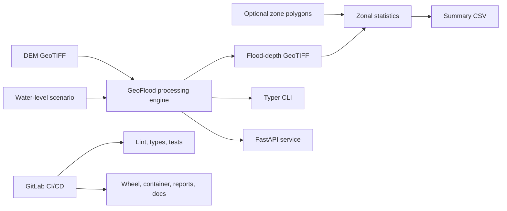

# GeoFlood CI/CD Platform

[](https://www.python.org/)
[](https://black.readthedocs.io/)
[](LICENSE)

GeoFlood is a production-style reference platform for reproducible geospatial flood-depth processing. It turns a digital elevation model (DEM) and a constant water-surface elevation into a georeferenced flood-depth raster, optional polygon summaries, API responses, and CI artifacts.

The featured real-world demonstration covers the tidal Elizabeth River and
Norfolk, Virginia, using a small public-domain USGS 3DEP bare-earth DEM. Tiny
synthetic data remain in the test suite so CI is deterministic and offline.

The project is intentionally scoped as a transparent static inundation
workflow—not a hydrodynamic or operational flood forecast. It demonstrates scientific Python engineering, raster data pipelines, testing, containers, documentation, and GitLab delivery practices.

## Architecture



The scientific kernel applies:

```text
flood_depth = max(water_level - terrain_elevation, 0)
```

Input CRS, transform, raster dimensions, and nodata values are preserved.

## Quick start

Python 3.11 or newer is required. Rasterio and GeoPandas publish Windows wheels, so a separate local GDAL installation is normally unnecessary.

```powershell
py -3.11 -m venv .venv
.\.venv\Scripts\Activate.ps1
python -m pip install --upgrade pip
pip install -e ".[dev]"
python scripts/generate_sample_data.py
```

Run the deterministic synthetic scenario:

```powershell
geoflood run `
  --dem tests/data/sample_dem.tif `
  --water-level 3.2 `
  --output outputs/demo_flood_depth.tif
```

Download and process the real Norfolk study area:

```powershell
python scripts/download_real_dem.py

geoflood run `
  --dem data/norfolk_elizabeth_river_dem.tif `
  --water-level 2.0 `
  --output outputs/norfolk_flood_depth_2m.tif `
  --report outputs/norfolk_report_2m.json
```

The `2.0` value is an illustrative constant elevation in the DEM's vertical
units, not a forecast or return-period water level. See [`data/`](data/) for
the exact bounding box, source request, and provenance metadata.

## Norfolk case study

| Attribute | Value |
| --- | --- |
| Location | Elizabeth River and Norfolk, Virginia |
| DEM source | USGS National Map 3D Elevation Program (3DEP) |
| Horizontal CRS | UTM Zone 18N (`EPSG:32618`) |
| Vertical datum | Not established by the current export provenance |
| Scenario water level | `2.0 m` |
| Modeled flooded area | Approximately `20.17 km²` (`4,985 acres`) |
| Mean depth over flooded cells | Approximately `1.62 m` |

The case study is a **simplified bathtub flood-depth workflow**, not a
hydrodynamic model. It does not represent flow connectivity, velocity,
time-varying water levels, drainage, or hydraulic structures.

GeoFlood uses a simplified bathtub calculation: every valid terrain cell below
the constant water-surface elevation receives a positive depth, regardless of
hydraulic connectivity. The DEM and water level must use the same vertical
datum and units.

The unmasked Norfolk DEM includes negative coastal and water-surface cells. For
example, a DEM elevation of `-7.21 m` with a `2.0 m` scenario produces a
mathematical depth of about `9.21 m`. The CLI and JSON report now display this
as a warning because it can indicate:

- unmasked water or bathymetry cells;
- a DEM referenced to a different vertical datum than the water level;
- invalid cells that were not encoded as nodata.

For land-only exposure screening, mask the DEM with a reviewed land polygon
before running GeoFlood. Keep water cells only when their elevation meaning and
vertical datum are understood. A land mask improves interpretation but does not
turn the bathtub model into a hydrodynamic simulation.

The report also records projected and longitude/latitude bounds, total and
flooded area in several units, DEM source and download metadata, and an
estimated flood volume calculated as:

```text
mean flooded-cell depth x flooded area
```

That volume is a raster summary of this simplified scenario, not a
hydrodynamic storage or discharge estimate.

Add polygon summaries:

```powershell
geoflood run `
  --dem tests/data/sample_dem.tif `
  --water-level 3.2 `
  --output outputs/demo_flood_depth.tif `
  --zones tests/data/sample_zones.geojson `
  --summary outputs/demo_zonal_stats.csv
```

The JSON report includes raster dimensions and resolution, DEM elevation
ranges, flooded area, means over both all valid cells and flooded cells, and a
visible `warnings` array.

## API demo

Start the development server:

```powershell
uvicorn geoflood.api:app --reload
```

Health check:

```bash
curl http://localhost:8000/health
```

Process a file visible to the API process:

```bash
curl -X POST http://localhost:8000/run-flood-scenario \
  -H "Content-Type: application/json" \
  -d '{"dem_path":"tests/data/sample_dem.tif","water_level":3.2,"output_name":"api_depth.tif"}'
```

Interactive OpenAPI documentation is available at
`http://localhost:8000/docs`.

## Docker

```powershell
docker compose up --build
```

The Compose configuration mounts synthetic tests at `/data`, the real study
area at `/real-data`, and writes results to the local `outputs` directory. Use
`/real-data/norfolk_elizabeth_river_dem.tif` for the Norfolk API demo.

## Quality checks

```powershell
ruff check src tests scripts
black --check src tests scripts
mypy src
pytest --cov=geoflood --cov-report=term-missing
mkdocs serve
```

## GitLab CI/CD

The pipeline in [`.gitlab-ci.yml`](.gitlab-ci.yml) uses six explicit stages:

| Stage | Purpose |
| --- | --- |
| `validate` | Ruff, Black, and strict mypy checks |
| `test` | Unit and integration tests with Cobertura coverage |
| `build` | Python distribution and OCI container image |
| `scan` | Python dependency audit and Trivy container scan |
| `package` | Reproducible demo raster, CSV, and JSON artifacts |
| `docs` | Strict MkDocs build and GitLab Pages artifact |

Container publishing expects the GitLab Container Registry variables supplied by GitLab CI. Dependency auditing is advisory; critical container findings fail the pipeline.

## Repository layout

```text
src/geoflood/       Reusable processing, CLI, API, and validation code
tests/              Unit, integration, and synthetic test inputs
data/               Small real USGS 3DEP study-area DEM and provenance
scripts/            Fixture and report generation
docs/               MkDocs technical documentation
outputs/            Ignored local and CI-generated products
.gitlab-ci.yml      Validate-to-document delivery pipeline
```
## Author

**Amin Ilia**  
Coastal / Geospatial / Scientific Software Engineer  

GitHub: https://github.com/aminilia 

LinkedIn: https://www.linkedin.com/in/amin-ilia-phd-225b714/


## Author

**Amin Ilia**  
Coastal / Geospatial / Scientific Software Engineer  
GitHub: https://github.com/aminilia  
LinkedIn: https://www.linkedin.com/in/amin-ilia-phd-225b714


## Documentation and license

See [`docs/`](docs/) for architecture, API, and pipeline details. This project is released under the [MIT License](LICENSE).
