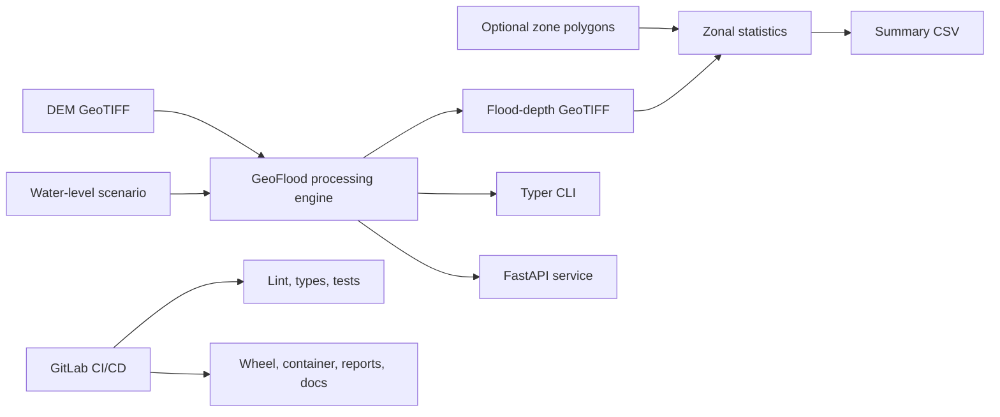

# GeoFlood CI/CD Platform

[](https://www.python.org/)
[](https://black.readthedocs.io/)
[](LICENSE)

GeoFlood is a production-style reference platform for reproducible geospatial flood-depth processing. It turns a digital elevation model (DEM) and a constant water-surface elevation into a georeferenced flood-depth raster, optional polygon summaries, API responses, and CI artifacts.

The project is intentionally scoped as a transparent static inundation
workflow—not a hydrodynamic or operational flood forecast. It demonstrate scientific Python engineering, raster data pipelines, testing, containers, documentation, and GitLab delivery practices.

## Architecture



The scientific kernel applies:

```text
flood_depth = max(water_level - terrain_elevation, 0)
```

Input CRS, transform, raster dimensions, and nodata values are preserved.

## Quick start

Python 3.11 or newer is required. Rasterio and GeoPandas publish Windows wheels, so a separate local GDAL installation is normally unnecessary.

```powershell
py -3.11 -m venv .venv
.\.venv\Scripts\Activate.ps1
python -m pip install --upgrade pip
pip install -e ".[dev]"
python scripts/generate_sample_data.py
```

Run the required CLI scenario:

```powershell
geoflood run `
  --dem tests/data/sample_dem.tif `
  --water-level 3.2 `
  --output outputs/demo_flood_depth.tif
```

Add polygon summaries:

```powershell
geoflood run `
  --dem tests/data/sample_dem.tif `
  --water-level 3.2 `
  --output outputs/demo_flood_depth.tif `
  --zones tests/data/sample_zones.geojson `
  --summary outputs/demo_zonal_stats.csv
```

## API demo

Start the development server:

```powershell
uvicorn geoflood.api:app --reload
```

Health check:

```bash
curl http://localhost:8000/health
```

Process a file visible to the API process:

```bash
curl -X POST http://localhost:8000/run-flood-scenario \
  -H "Content-Type: application/json" \
  -d '{"dem_path":"tests/data/sample_dem.tif","water_level":3.2,"output_name":"api_depth.tif"}'
```

Interactive OpenAPI documentation is available at
`http://localhost:8000/docs`.

## Docker

```powershell
docker compose up --build
```

The Compose configuration mounts `tests/data` read-only at `/data` and writes results to the local `outputs` directory. Use `/data/sample_dem.tif` as the API input path.

## Quality checks

```powershell
ruff check src tests scripts
black --check src tests scripts
mypy src
pytest --cov=geoflood --cov-report=term-missing
mkdocs serve
```

## GitLab CI/CD

The pipeline in [`.gitlab-ci.yml`](.gitlab-ci.yml) uses six explicit stages:

| Stage | Purpose |
| --- | --- |
| `validate` | Ruff, Black, and strict mypy checks |
| `test` | Unit and integration tests with Cobertura coverage |
| `build` | Python distribution and OCI container image |
| `scan` | Python dependency audit and Trivy container scan |
| `package` | Reproducible demo raster, CSV, and JSON artifacts |
| `docs` | Strict MkDocs build and GitLab Pages artifact |

Container publishing expects the GitLab Container Registry variables supplied by GitLab CI. Dependency auditing is advisory; critical container findings fail the pipeline.

## Repository layout

```text
src/geoflood/       Reusable processing, CLI, API, and validation code
tests/              Unit, integration, and synthetic test inputs
scripts/            Fixture and report generation
docs/               MkDocs technical documentation
outputs/            Ignored local and CI-generated products
.gitlab-ci.yml      Validate-to-document delivery pipeline
```

## Documentation and license

See [`docs/`](docs/) for architecture, API, and pipeline details. This project is released under the [MIT License](LICENSE).
