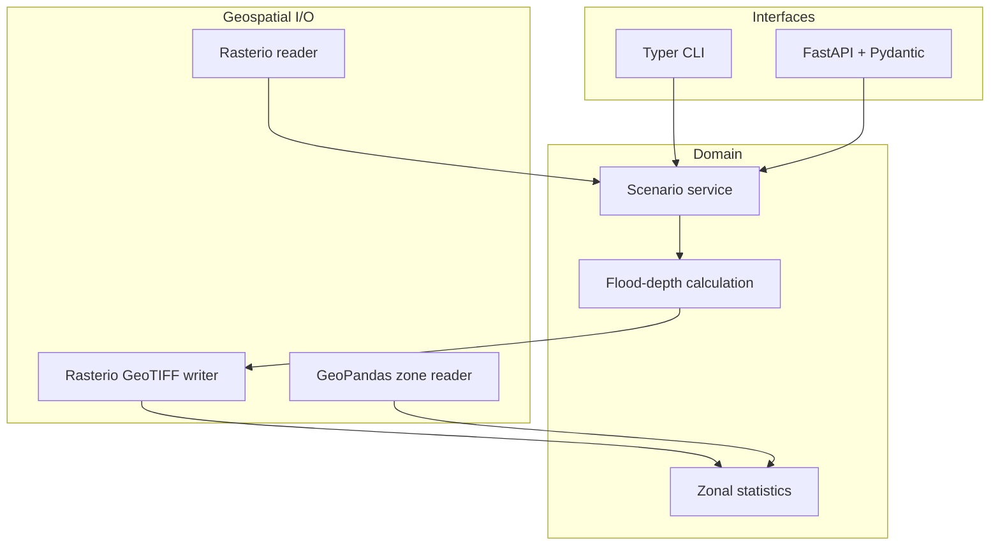

# Architecture

## Component flow

Both external interfaces delegate to `run_flood_scenario`, preventing the CLI
and API from developing different scientific behavior.

## Data contracts

The raster layer accepts one single-band DEM. The output uses `float32`, DEFLATE
compression, and the source nodata value. The API validates water-level bounds,
GeoTIFF extensions, and output filenames before disk access.

## Operational boundaries

- A configurable cell-count limit protects the API from unexpectedly large
  requests.
- Output filenames cannot contain path separators.
- The Docker image runs as an unprivileged user.
- Automated test datasets are deterministic and synthetic.
- The real Norfolk demo is downloaded reproducibly from USGS 3DEP and includes
  machine-readable provenance; CI tests do not depend on that network request.
- Scenario reports preserve warnings for negative elevations, depth greater
  than water level, missing CRS, and missing nodata metadata.
- The platform is path-based by design; object storage and job queues are
  plausible future extensions, not hidden dependencies.
