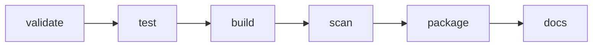

# GitLab CI/CD

The pipeline emphasizes early feedback and immutable evidence.

## Stages

1. **Validate** runs Ruff, Black, and strict mypy.
2. **Test** regenerates synthetic inputs and publishes coverage.
3. **Build** creates a wheel/source distribution and pushes a commit-tagged
   image to the GitLab Container Registry.
4. **Scan** audits Python dependencies and scans the pushed image with Trivy.
5. **Package** runs a representative flood scenario and retains GeoTIFF, CSV,
   and JSON outputs as expiring artifacts.
6. **Docs** builds strict MkDocs content; the default branch publishes the
   `public/` artifact for GitLab Pages.

## Reproducibility

The demo job generates its own small inputs. CI does not download operational
flood data, depend on private file shares, or write outside the project
workspace. Package and output artifacts expire after one week to control
storage.

## Security posture

The application image runs as a non-root user and includes a health check.
`pip-audit` is advisory so newly disclosed dependency findings remain visible
without abruptly blocking development. Trivy fails the pipeline for critical
container findings.
